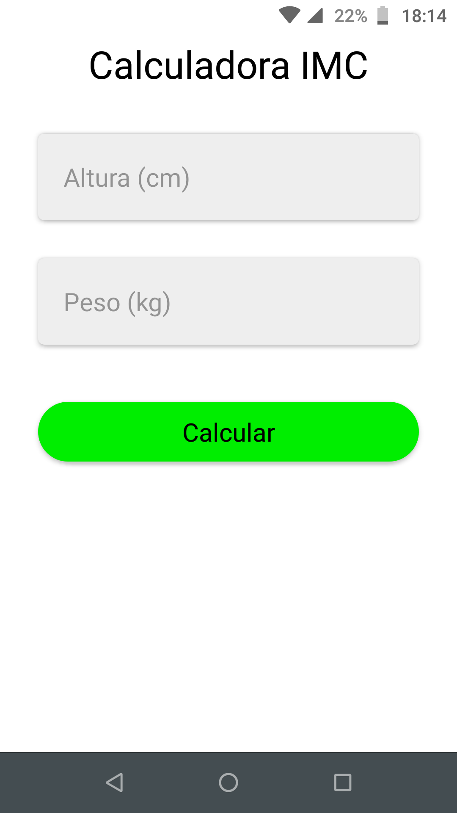
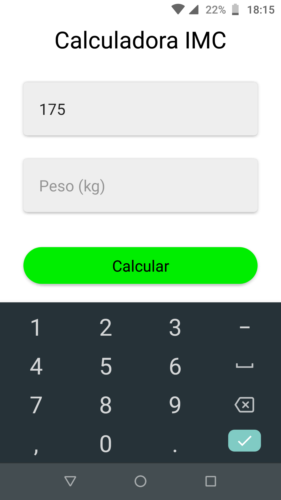

# Calc IMC ⚖️🏋️

Aplicativo que calcula o indice de massa corporea(IMC).
Desenvolvido usando React Native e expo.
## Screenshots




## Executar
Dentro do diretorio
```
  expo start

```
**obs.:** baixar o app do expo.

